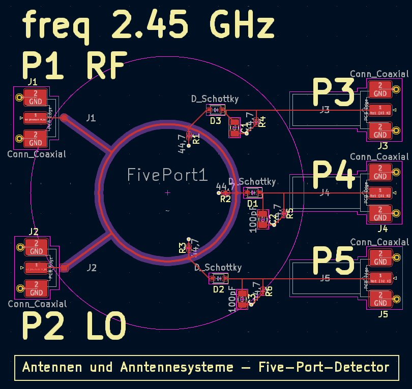

# FivePortDetector

PlatformIO based firmware for testing and calibrating a Five-Port Detector using IQ bit sequences. The five-port ring is used as a phase/DOA (direction-of-arrival) receiver at 2.45 GHz; the firmware handles in-system calibration, demodulation and angle computation.

Instead of an active IQ mixer, the phase and amplitude of the received RF
signal are recovered purely from the power levels at three diode detectors
fed by a passive five-port junction. This keeps the RF front-end simple and
wideband, but the three nonlinear detector voltages first need to be mapped
back to baseband $I$/$Q$ — that mapping is what this firmware calibrates and
runs in real time.

## Calibration principle

On startup (and on demand via a push button) the MCU emits a known QPSK
training sequence and records the resulting detector voltages
$v_1, v_2, v_3$. A least-squares fit against the known transmitted symbols
yields the inverse-model coefficients (`rg`, `ig`) needed to reconstruct
$I$/$Q$ from arbitrary detector voltages afterwards — this in-system
calibration replaces a classical two-port calibration with reflection
standards and a network analyzer.

## Branches

- `main` — stable baseline
- `iq-calibration` — Phase 1: single five-port receiver, in-system IQ calibration and continuous phase readout
- `doa-detector` — Phase 2: two five-port receivers, interferometric DOA computation from the phase difference between both rings

## Hardware targets

- `genericSTM32F411RE` (Nucleo-64, ST-Link upload)
- `lptm4c1294ncpdt` (EK-TM4C129EXL, XDS110 on-board debugger, no external programmer needed)
